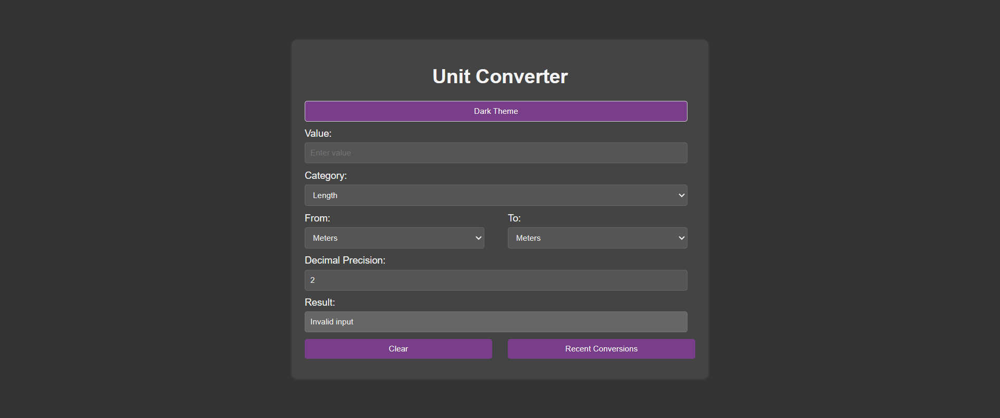

# Unit Coverter

A simple and intuitive unit converter that allows users to convert between various units of measurement across different categories. It supports unit conversions for length, weight, temperature, volume, area, speed, and time, with a dark/light theme toggle, decimal precision control, and recent conversion history storage.

## 🖼️ Preview

## Features

- **Unit Categories**: Choose from multiple categories such as Length, Weight, Temperature, Volume, Area, Speed, and Time.
- **Unit Selection**: Easily select the units for conversion from and to (e.g., meters to kilometers, Celsius to Fahrenheit).
- **Decimal Precision**: Customize the decimal precision for the results.
- **History**: View and store the recent conversion history in the browser’s local storage (up to 5 conversions).
- **Dark/Light Mode**: Toggle between dark and light themes for a better user experience.
- **Responsive Design**: The application is fully responsive and works on both desktop and mobile devices.

## Technologies Used

- **HTML5**: Structure of the application.
- **CSS3**: Styling and responsive design.
- **JavaScript**: Functionality for unit conversion, theme toggle, and history management.
- **LocalStorage**: Storing recent conversions in the browser’s local storage.

## Instructions

1. Open the application in your browser.
2. Enter the value you want to convert in the "Value" input field.
3. Select the unit category (e.g., Length, Weight) from the dropdown.
4. Choose the units you want to convert from and to.
5. The result will be shown in the "Result" input field. You can specify the number of decimal places using the "Decimal Precision" field.
6. Toggle between light and dark themes using the "Dark Theme" button.
7. View recent conversions by clicking the "Recent Conversions" button.

